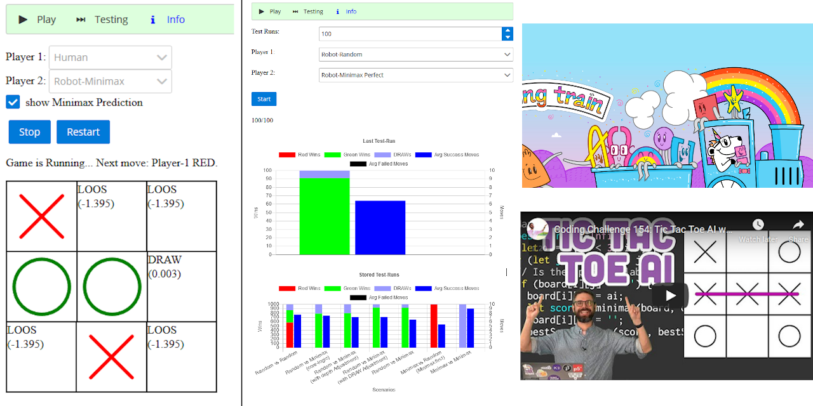

# Ai-TicTacToe-Minimax

Artificial-Intelligence learning-project for tic-tac-toe with simple minimax algorithm

A detailed explanation about the minimax algorithm can be found on [thecodingtrain.com](https://thecodingtrain.com/) the [Coding Challenge 154](https://youtu.be/trKjYdBASyQ). 

A deployed Version is available on: http://brabenetz.net/learning/ai-tic-tac-toe-minimax/#/information

Run `npm start` for a local dev server. Then navigate to `http://localhost:4200/learning/ai-tic-tac-toe-minimax`.
